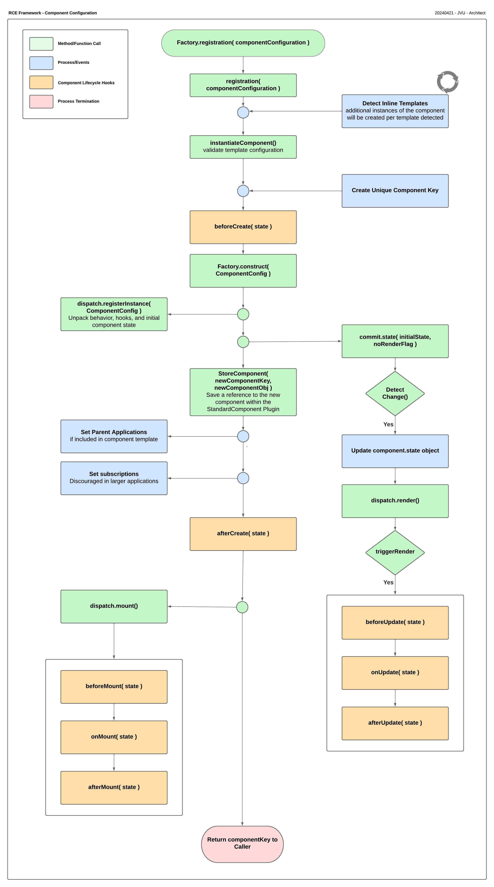

# Component Lifecycle Hooks

Here are all the lifecycle hooks available to components. These hooks allow developers to execute custom code at different stages of a component's lifecycle:

|Hook Name|Description|
|---------|-----------|
|beforeCreate|Executes before a component is created.|
|beforeUpdate|Executes before a component is updated.|
|onUpdate|Executes when a component is being updated.|
|afterUpdate|Executes after a component update has been completed.|
|afterCreate|Executes after a component is created.|
|beforeMount|Executes before a component is mounted to the DOM.|
|onMount|Executes when a component is being mounted to the DOM.|
|afterMount|Executes after a component has been mounted to the DOM.|

## Component Configuration & Lifecycle
