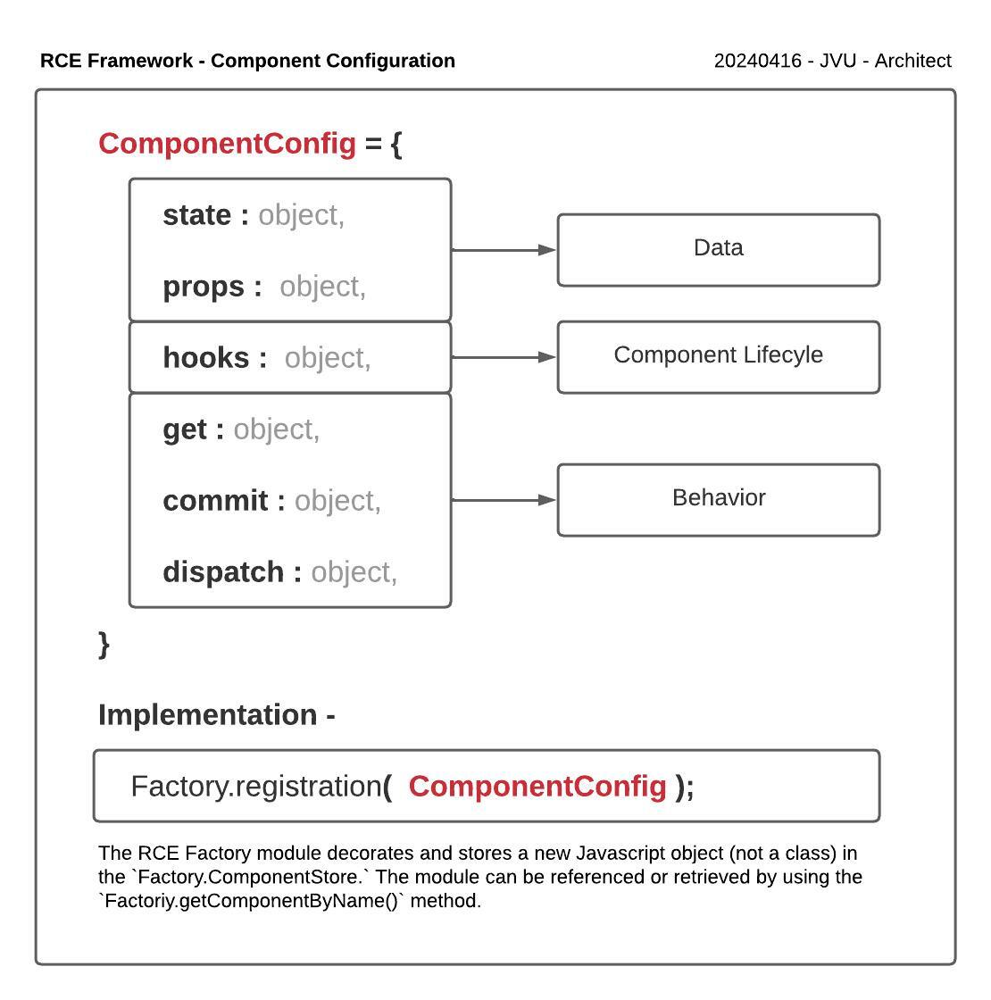

# Glossary - Public Component Methods

The following methods are available within RCE components and can be referenced during the configuration of component and called dynamically after creating an instance of a component.

## Table of Contents

1. [Getters](#getters)
    - [`get.state`](#getstate)
    - [`get.props`](#getprops)
    - [`get.ref`](#getref)
    - [`get.obeservers`](#getobservers)
    - [`get.inlineTemplateNode`](#getinlinetemplatenode)
    - [`get.templateString`](#gettemplatestring)
    - [`get.component`](#getcomponent)
1. [Commits](#commits)
    - [`commit.state`](#commitstate)
    - [`commit.props`](#commitprops)
    - [`commit.component`](#commitcomponent)
    - [`commit.ref`](#commitref)
1. [Dispatch](#dispatch)
    - [`dispatch.render`](#dispatchrender)
    - [`dispatch.update`](#dispatchupdate)
    - [`dispatch.insertTemplate`](#dispatchinserttemplate)
    - [`dispatch.createInlineTemplate`](#dispatchcreateinlinetemplate)
    - [`dispatch.createNodeFromTemplate`](#dispatchcreatenodefromtemplate)
    - [`dispatch.createTemplateNode`](#dispatchcreatetemplatenode)
    - [`dispatch.mount`](#dispatchmount)
    - [`dispatch.notifyEventBus`](#dispatchnotifyeventbus)
    - [`dispatch.registerInstance`](#dispatchregisterinstance)

## Component Configuration



## Getters 

1. ### **`get.state`**

    Returns the component's entire state object or a specific field within the state.

    ```javascript
    let state = this.component().get.state();
    let specificState = this.component().get.state('key'); // Get 'key' from the state
    ```

1. ### **`get.props`**

    Returns the component's properties or a specific property.

    ```javascript
    let props = this.component().get.props();
    let specificProp = this.component().get.props('isEnabled'); // Get 'isEnabled' property
    ```

1. ### **`get.ref`**

    Returns a reference to the component's DOM node.

    ```javascript
    let componentRef = this.component().get.ref();
    ```

1. ### **`get.observers`**

    Retrieves registered observers for the component.

    ```javascript
    let observers = this.component().get.observers();
    let specificObserver = this.component().get.observers('observerName');
    ```

1. ### **`get.inlineTemplateNode`**

    Returns the inline template node associated with the component.

    ```javascript
    let inlineTemplateNode = this.component().get.inlineTemplateNode();
    ```

1. ### **`get.templateString`**

    Returns the component's template as a string.

    ```javascript
    let templateString = this.component().get.templateString();
    ```

1. ###  **`get.component`**

    Provides access to component's commit, dispatch, and hooks methods.

    ```javascript
    let componentMethods = this.component().get.component();
    ```

## Commits

1. ### **`commit.state`**

    Commits changes to the component's state and manages rendering and event notifications.

    ```javascript
    this.component().commit.state({ key: 'newValue' }, triggerRender = true, triggerNotification = true );
    ```

1. ### **`commit.props`**

    Updates the component's props based on provided values.

    ```javascript
    this.component().commit.props({ isEnabled: false });
    ```

1. ### **`commit.ref`**

    Updates the component's reference to a DOM node.

    ```javascript
    this.component().commit.ref(string);
    ```

1. ### **`commit.component`**

    Provides access to component's get, dispatch, and hooks methods.

    ```javascript
    let componentAccess = this.component().commit.component();
    ```

## Dispatch

1. ### **`dispatch.update`**

    Manages updates in response to event bus notifications.

    ```javascript
    // Developers need to define how update is handled
    this.component().dispatch.update('keyUpdate', { newKey: 'value' });
    ```

1. ### **`dispatch.notifyEventBus`**

    Notifies the event bus about changes in the component.

    ```javascript
    this.component().dispatch.notifyEventBus('keyUpdate', { newKey: 'value' });
    ```

1. ### **`dispatch.insertTemplate`**

    Inserts the component's template into the DOM at a specified selector.

    ```javascript
    this.component().dispatch.insertTemplate('#container', 'append');
    ```

1. ### **`dispatch.mount`**

    Manages component mounting processes including hooks and event bus notifications.

    ```javascript
    this.component().dispatch.mount();
    ```

1. ###  **`dispatch.render`**

    Manages rendering processes and executes relevant hooks.

    ```javascript
    this.component().dispatch.render({ updatedKey: 'updatedValue' });
    ```

1. ### **`dispatch.registerInstance`**

    Registers a component instance with updated methods if provided in the configuration.

    ```javascript
    this.component().dispatch.registerInstance(newComponentConfig);
    ```

1. ### **`dispatch.createInlineTemplate`**

    Creates an inline template node based on the provided template string.

    ```javascript
    this.component().dispatch.createInlineTemplate('<div>New Content</div>', 'componentKey');
    ```

1. ### **`dispatch.createNodeFromTemplate`**

    Alias for createInlineTemplate.

    ```javascript
    this.component().dispatch.createNodeFromTemplate(
        '<div>New Content</div>', 'componentKey'
    );
    ```

1. ### **`dispatch.createTemplateNode`**

    Generates a template node from the component's template string.

    ```javascript
    let newTemplateNode = this.component().dispatch.createTemplateNode();
    ```